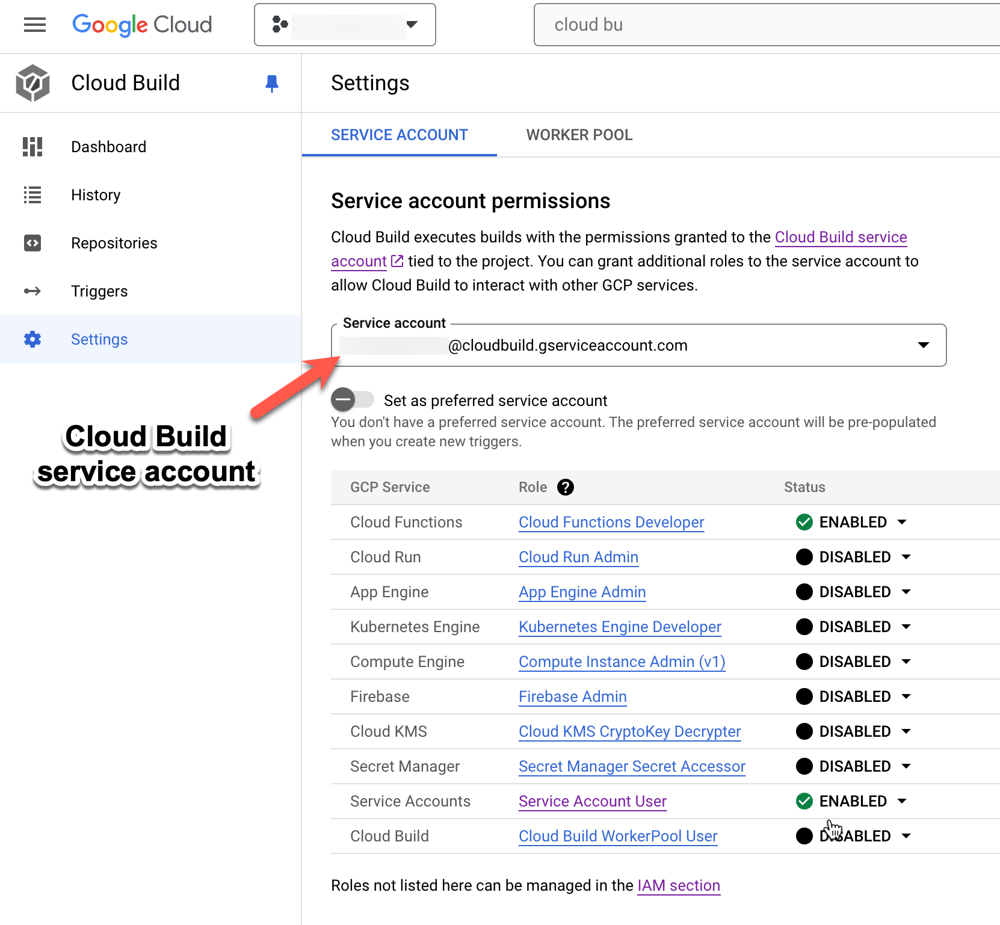

# Gather JumpCloud Directory Insights Data with GCP Services
_This document will walk a JumpCloud Administrator through deploying this Serverless Application to GCP._

_Note: This document assumes the use of Python 3.9_
## Table of Contents
- [Gather JumpCloud Directory Insights Data with GCP Services](#gather-jumpcloud-directory-insights-data-with-gcp-services)
  - [Table of Contents](#table-of-contents)
  - [Pre-requisites](#pre-requisites)
  - [Create Directory to Store Directory Insights Files](#create-directory-to-store-directory-insights-files)
  - [Edit CloudBuild.yaml](#edit-cloudbuildyaml)
  - [Deploying the Application](#deploying-the-application)

## Pre-requisites
- [Your JumpCloud API key](https://docs.jumpcloud.com/2.0/authentication-and-authorization/authentication-and-authorization-overview)
- Google Cloud Admin/Owner account with these roles:
  - ```roles/serviceusage.serviceUsageAdmin```
  - ```roles/cloudbuild.builds.editor```
  - ```roles/resourcemanager.projects.setIamPolicy```
- [GCLOUD CLI installed](https://cloud.google.com/sdk/docs/install)
  - After installing the CLI, run ```gcloud auth login ``` and login with your Admin/Owner account
- On your CLI, run these commands to enable the [services](https://cloud.google.com/apis?hl=en) needed to build the app:
  - ```gcloud services enable cloudbuild.googleapis.com```
  - ```gcloud services enable cloudfunctions.googleapis.com```
  - ```gcloud services enable cloudscheduler.googleapis.com```
  - ```gcloud services enable storage-component.googleapis.com```
  - ```gcloud services enable secretmanager.googleapis.com```
  - ```gcloud services enable cloudresourcemanager.googleapis.com```
- Your GCP Project ID and Number, on your CLI you can run ```gcloud projects list``` to get your project's name and ID
  - On your CLI create a variable for Project ID and Number so that you won't need to insert these variables on the commands below:
    - ```PROJECTID=INSERTYOURGCPID```
    - ```PROJECTNUM=INSERTYOURGCPNUM```
- You must assign the Cloud Build Service account [roles](https://console.cloud.google.com/cloud-build/settings/). This account will have the suffix ```ProjectNumber@cloudbuild.gserviceaccount.com``` These can be removed after the build has succeeded:
  - Cloud Functions Developer
    - ```gcloud projects add-iam-policy-binding $PROJECTID --member=serviceAccount:$PROJECTNUM@cloudbuild.gserviceaccount.com --role=roles/cloudfunctions.developer```
  - Service Account User
    - ```gcloud projects add-iam-policy-binding sa-slackbot --member=serviceAccount:$PROJECTNUM@cloudbuild.gserviceaccount.com --role=roles/iam.serviceAccountUser```
  - Secrets Manager Admin
    - ```gcloud projects add-iam-policy-binding sa-slackbot --member=serviceAccount:$PROJECTNUM@cloudbuild.gserviceaccount.com --role roles/secretmanager.admin```
  - Storage Admin
    - ```gcloud projects add-iam-policy-binding sa-slackbot --member=serviceAccount:$PROJECTNUM@cloudbuild.gserviceaccount.com --role roles/storage.admin```
  - Cloud Functions Invoker
    - ```gcloud projects add-iam-policy-binding sa-slackbot --member=serviceAccount:$PROJECTNUM@cloudbuild.gserviceaccount.com --role roles/cloudfunctions.invoker```
  - Cloud Build Builder
    - ```gcloud projects add-iam-policy-binding sa-slackbot --member=serviceAccount:$PROJECTNUM@cloudbuild.gserviceaccount.com --role roles/cloudbuild.builds.builder```
  - Cloud Scheduler Admin
    - ```gcloud projects add-iam-policy-binding sa-slackbot --member=serviceAccount:$PROJECTNUM@cloudbuild.gserviceaccount.com --role roles/cloudscheduler.admin```
  - 
- You must assign the Compute Service account. This account will have the suffix ```*compute@developer.gserviceaccount.com``` These can be removed after the build has succeeded:

  - Artifact Registry Administrator
    - ```gcloud projects add-iam-policy-binding $PROJECTID --member=serviceAccount:$PROJECTNUM-compute@developer.gserviceaccount.com --role roles/artifactregistry.admin```

  - Cloud Functions Developer
    - ```gcloud projects add-iam-policy-binding $PROJECTID --member=serviceAccount:$PROJECTNUM-compute@developer.gserviceaccount.com --role roles/cloudfunctions.developer```

  - Cloud Functions Invoker
    - ```gcloud projects add-iam-policy-binding $PROJECTID --member=serviceAccount:$PROJECTNUM-compute@developer.gserviceaccount.com --role roles/cloudfunctions.invoker```

  - Cloud Scheduler Admin
    - ```gcloud projects add-iam-policy-binding $PROJECTID --member=serviceAccount:$PROJECTNUM-compute@developer.gserviceaccount.com --role roles/cloudscheduler.admin```

  - Secret Manager Admin
    - ```gcloud projects add-iam-policy-binding $PROJECTID --member=serviceAccount:$PROJECTNUM-compute@developer.gserviceaccount.com --role roles/secretmanager.admin```

  - Secret Manager Secret Accessor
    - ```gcloud projects add-iam-policy-binding $PROJECTID  --member=serviceAccount:$PROJECTNUM-compute@developer.gserviceaccount.com --role roles/secretmanager.secretAccessor```

  - Storage Admin
    - ```gcloud projects add-iam-policy-binding $PROJECTID  --member=serviceAccount:$PROJECTNUM-compute@developer.gserviceaccount.com --role roles/storage.admin```

  - Service Account User
    - ```gcloud projects add-iam-policy-binding $PROJECTID  --member=serviceAccount:$PROJECTNUM-compute@developer.gserviceaccount.com --role roles/iam.serviceAccountUser```
- You must also assign roles to the App Engine service account. This account will have the suffix @appspot.gserviceaccount.com

  - Secret Manager Secret Accessor
    - ```gcloud projects add-iam-policy-binding $PROJECTID --member=serviceAccount:$PROJECTID@appspot.gserviceaccount.com --role roles/secretmanager.secretAccessor```
  - Storage Admin
    - ```gcloud projects add-iam-policy-binding $PROJECTID --member=serviceAccount:$PROJECTID@appspot.gserviceaccount.com  --role roles/storage.admin```
  - Cloud Functions Invoker
    - ```gcloud projects add-iam-policy-binding $PROJECTID --member=serviceAccount:$PROJECTID@appspot.gserviceaccount.com --role roles/cloudfunctions.invoker```
  
## Create Directory to Store Directory Insights Files

Create a directory to store your Serverless Application and any dependencies required. In the root of that directory add [Directory Insights Files](https://github.com/TheJumpCloud/JumpCloud-Serverless/blob/master/GCP/DirectoryInsights/).
Install the dependencies in requirements.txt file

```bash
~/DirectoryInsights$ pip install -r requirements.txt
```

## Edit CloudBuild.yaml

In the root directory, edit cloudbuid.yaml file `substitutions` variable values `CHANGEVALUE` with the necessary credentials

## Deploying the Application

GCloud CLI

Using the GCLOUD CLI, you can [Cloud Build Deploy](https://cloud.google.com/sdk/gcloud/reference/builds/submit) directly from the project directory
```bash
~/DirectoryInsights$ gcloud builds submit
```
_Note: `gcloud builds submit` default config is "cloudbuild.yaml" which is why we do not need to specify `--config=config.yaml` tag_
_Note: `.gcloudignore` file excludes unwanted files/folders from getting push in the deploy process_
_Note: Logs the service/s, timestamps, and Powershell script for the current API call when the app is ran. The script creates .gz file to be imported in AWS manually incase of timeouts or errors during operation_


