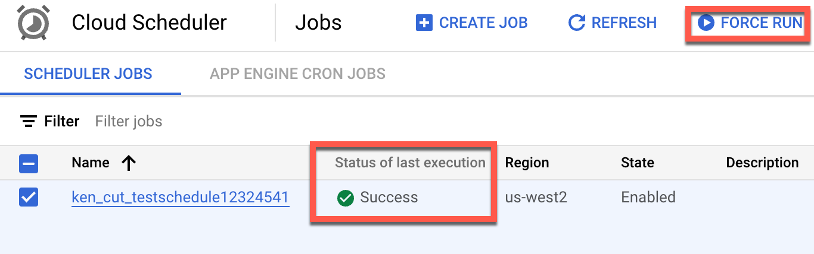
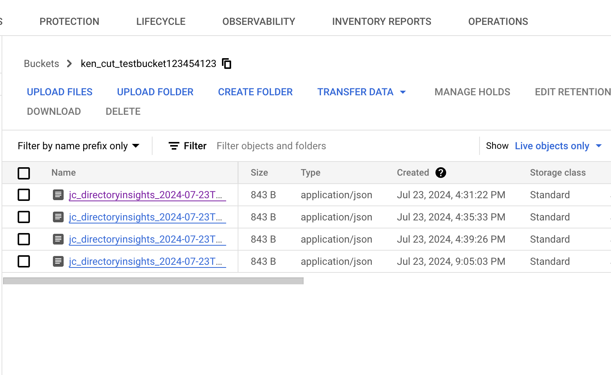
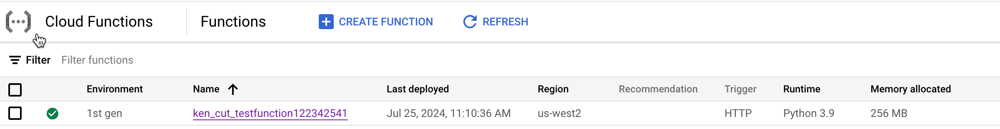

# Gather JumpCloud Directory Insights Data with GCP Services

_This document will walk a JumpCloud Administrator through deploying this Serverless Application to GCP._

_Note: This document assumes the use of Python 3.12 on GCP Cloud Functions_

# Table of Contents

- [Gather JumpCloud Directory Insights Data with GCP Services](#gather-jumpcloud-directory-insights-data-with-gcp-services)
- [Table of Contents](#table-of-contents)
- [What This Application Builds](#what-this-application-builds)
  - [Deployed Components](#deployed-components)
    - [1. Cloud Functions (3 Total)](#1-cloud-functions-3-total)
    - [2. Pub/Sub Messaging Layer](#2-pubsub-messaging-layer)
    - [3. Cloud Storage](#3-cloud-storage)
    - [4. Cloud Scheduler](#4-cloud-scheduler)
    - [5. Secret Manager](#5-secret-manager)
  - [Key Features](#key-features)
- [Pre-requisites](#pre-requisites)
- [Create Directory to Store Directory Insights Files](#create-directory-to-store-directory-insights-files)
- [Edit CloudBuild.yaml](#edit-cloudbuildyaml)
- [Deploying the Application](#deploying-the-application)
- [Manual Testing \& Historical Backfill](#manual-testing--historical-backfill)
    - [Option 1: Using the Google Cloud Console](#option-1-using-the-google-cloud-console)
    - [Option 2: Using the gcloud CLI](#option-2-using-the-gcloud-cli)
- [Pipeline Architecture \& Error Handling (DLQ)](#pipeline-architecture--error-handling-dlq)
  - [Dead Letter Queue (DLQ)](#dead-letter-queue-dlq)
  - [Redriving Failed Messages](#redriving-failed-messages)
    - [Option 1: Using the Google Cloud Console](#option-1-using-the-google-cloud-console-1)
    - [Option 2: Using the gcloud CLI](#option-2-using-the-gcloud-cli-1)
- [Remove Cloud Build Roles](#remove-cloud-build-roles)

# What This Application Builds

This serverless application automates the extraction of **JumpCloud Directory Insights** data and stores it in **Google Cloud Storage**. By utilizing an event-driven "Orchestrator-Worker" pattern, it efficiently handles large volumes of event logs without hitting Cloud Function execution limits.

## Deployed Components

The `gcloud builds submit` command orchestrates the creation of the following infrastructure:

### 1. Cloud Functions (3 Total)

- **Orchestrator Function:** An HTTP-triggered function that acts as the "brain." It calculates the time window (e.g., the last 5 minutes) and determines how many parallel jobs are needed based on the event count in JumpCloud.
- **Worker Function:** A background function triggered by Pub/Sub. It performs the heavy lifting: querying the JumpCloud API, paginating through results, sanitizing data for BigQuery compatibility, and uploading compressed GZIP files to Storage.
- **Redrive Function:** An administrative HTTP function used to move failed messages from the Dead Letter Queue back into the main processing pipeline. Whenever a job fails 5 times, it sits in the DLQ; this function "redrives" those jobs so they can be processed by the Worker again once the issue (like an API outage) is resolved.

### 2. Pub/Sub Messaging Layer

- **Main Topic (`jc-di-jobs`):** The communication channel where the Orchestrator posts job instructions for the Workers to pick up.
- **Dead Letter Topic (`jc-di-jobs-dlq`):** A safety net topic where jobs are sent if they fail to process after 5 consecutive attempts.
- **Pull Subscription:** A dedicated subscription on the DLQ topic that holds failed messages until they are redriven or expire.
- **ReDrive Function:** A dedicated subscription on the DLQ topic that holds failed messages until they are redriven or expire.

### 3. Cloud Storage

- **Data Bucket:** A permanent storage location for your Directory Insights logs. Files are stored as compressed GZIP files, supporting **MultiLine**, **SingleLine**, or **NDJson** formats.

### 4. Cloud Scheduler

- **Cron Job:** A managed scheduler that pings the Orchestrator at your defined interval (e.g., every 5 minutes) to ensure continuous data collection.

### 5. Secret Manager

- **API Credentials:** Secure storage for your `JumpCloud API Key` and `Organization ID`, ensuring no sensitive credentials are hardcoded in the functions or environment variables.

## Key Features

- **Auto-Scaling:** If JumpCloud has 100,000 events in a 5-minute window, the Orchestrator will automatically split that into multiple Pub/Sub messages, allowing multiple Worker instances to process the data simultaneously.
- **BigQuery Ready:** When using the `NDJson` format, the application automatically sanitizes JSON keys (replacing spaces/hyphens with underscores) to ensure the files can be ingested into BigQuery without schema errors.
- **Manual Recovery:** The "Force Run" logic allows you to trigger a large historical backfill (up to 90 days) simply by clicking "Force Run" in the Cloud Scheduler console.

# Pre-requisites

- [Your JumpCloud API key](https://docs.jumpcloud.com/2.0/authentication-and-authorization/authentication-and-authorization-overview)
- Google Cloud Admin/Owner account with these roles:
  - `roles/serviceusage.serviceUsageAdmin`
  - `roles/cloudbuild.builds.editor`
  - `roles/resourcemanager.projects.setIamPolicy`
- [GCLOUD CLI installed](https://cloud.google.com/sdk/docs/install)
  - After installing the CLI, run `gcloud auth login` and login with your Admin/Owner account
- On your CLI, run these commands to enable the [services](https://cloud.google.com/apis?hl=en) needed to build the app:

```bash
gcloud services enable cloudbuild.googleapis.com
gcloud services enable run.googleapis.com
gcloud services enable cloudscheduler.googleapis.com
gcloud services enable storage-component.googleapis.com
gcloud services enable secretmanager.googleapis.com
gcloud services enable cloudresourcemanager.googleapis.com
gcloud services enable pubsub.googleapis.com
```

- Your GCP Project ID and Number. You can automatically fetch and set these as variables in your CLI so you won't need to manually insert them in the commands below. Run this block in your terminal:

```bash
PROJECTID=$(gcloud config get-value project)
PROJECTNUM=$(gcloud projects describe $PROJECTID --format="value(projectNumber)")
echo "Project ID set to: $PROJECTID"
echo "Project Number set to: $PROJECTNUM"
```

- You must assign the Cloud Build Service account `ProjectNumber@cloudbuild.gserviceaccount.com` [roles](https://console.cloud.google.com/cloud-build/settings/). This account serves as an identity with specific roles to build the necessary services. [Cloud Build Service Account](https://cloud.google.com/build/docs/cloud-build-service-account)

```bash
gcloud projects add-iam-policy-binding $PROJECTID --member=serviceAccount:$PROJECTNUM@cloudbuild.gserviceaccount.com --role=roles/iam.serviceAccountUser
gcloud projects add-iam-policy-binding $PROJECTID --member=serviceAccount:$PROJECTNUM@cloudbuild.gserviceaccount.com --role=roles/secretmanager.admin
gcloud projects add-iam-policy-binding $PROJECTID --member=serviceAccount:$PROJECTNUM@cloudbuild.gserviceaccount.com --role=roles/storage.admin
gcloud projects add-iam-policy-binding $PROJECTID --member=serviceAccount:$PROJECTNUM@cloudbuild.gserviceaccount.com --role=roles/run.admin
gcloud projects add-iam-policy-binding $PROJECTID --member=serviceAccount:$PROJECTNUM@cloudbuild.gserviceaccount.com --role=roles/cloudbuild.builds.builder
gcloud projects add-iam-policy-binding $PROJECTID --member=serviceAccount:$PROJECTNUM@cloudbuild.gserviceaccount.com --role=roles/cloudscheduler.admin
gcloud projects add-iam-policy-binding $PROJECTID --member=serviceAccount:$PROJECTNUM@cloudbuild.gserviceaccount.com --role=roles/secretmanager.secretAccessor
gcloud projects add-iam-policy-binding $PROJECTID --member=serviceAccount:$PROJECTNUM@cloudbuild.gserviceaccount.com --role=roles/cloudfunctions.invoker
gcloud projects add-iam-policy-binding $PROJECTID --member=serviceAccount:$PROJECTNUM@cloudbuild.gserviceaccount.com --role=roles/cloudfunctions.developer
gcloud projects add-iam-policy-binding $PROJECTID --member=serviceAccount:$PROJECTNUM@cloudbuild.gserviceaccount.com --role=roles/pubsub.admin
gcloud projects add-iam-policy-binding $PROJECTID --member=serviceAccount:$PROJECTNUM@cloudbuild.gserviceaccount.com --role=roles/resourcemanager.projectIamAdmin
```

- You must assign roles to the compute developer service account to access the secrets manager

```bash
gcloud projects add-iam-policy-binding $PROJECTID --member=serviceAccount:$PROJECTNUM-compute@developer.gserviceaccount.com --role roles/secretmanager.secretAccessor
```

- You must also assign roles to the App Engine service account `*@appspot.gserviceaccount.com`. This account serves as identity when accessing Cloud Storage and Secret Manager. [Function Identity](https://cloud.google.com/functions/docs/securing/function-identity#:~:text=Every%20function%20is%20associated%20with,as%20its%20runtime%20service%20account.)

```bash
gcloud projects add-iam-policy-binding $PROJECTID --member=serviceAccount:$PROJECTID@appspot.gserviceaccount.com --role roles/secretmanager.secretAccessor
gcloud projects add-iam-policy-binding $PROJECTID --member=serviceAccount:$PROJECTID@appspot.gserviceaccount.com  --role roles/storage.admin
gcloud projects add-iam-policy-binding $PROJECTID --member=serviceAccount:$PROJECTID@appspot.gserviceaccount.com --role roles/run.admin
gcloud projects add-iam-policy-binding $PROJECTID --member=serviceAccount:$PROJECTID@appspot.gserviceaccount.com --role roles/cloudfunctions.admin
```

# Create Directory to Store Directory Insights Files

Create a directory to store your Serverless Application and any dependencies required. In the root of that directory add [Directory Insights Files](https://github.com/TheJumpCloud/JumpCloud-Serverless/blob/master/GCP/DirectoryInsights/).

# Edit CloudBuild.yaml

In the root directory, edit cloudbuid.yaml file `substitutions` variable values `CHANGEVALUE` with the necessary credentials

# Deploying the Application

Using the GCLOUD CLI, you can [Cloud Build Deploy](https://cloud.google.com/sdk/gcloud/reference/builds/submit) directly from the project directory

```bash
~/DirectoryInsights$ gcloud builds submit
```

_Note: `gcloud builds submit` default config is "cloudbuild.yaml" which is why we do not need to specify `--config=config.yaml` tag_
_Note: `.gcloudignore` file excludes unwanted files/folders from getting push in the deploy process_
_Note: After a successful build, validate that each services are running properly. You can do this by doing a FORCE RUN on the schedule we created, this will trigger the function to run the DI app script and saved the log files to Cloud Scheduler:_




Using the GCLOUD CLI, you can [Cloud Build Deploy](https://cloud.google.com/sdk/gcloud/reference/builds/submit) directly from the project directory


# Manual Testing & Historical Backfill

**⚠️ WARNING regarding Data Duplication:** Running a manual historical backfill for dates that have already been processed by the Cloud Scheduler (or running the same backfill multiple times) **will result in duplicate event records** in your Cloud Storage bucket. This application extracts raw data and does not inherently deduplicate existing storage files. If you need to backfill, ensure you are pulling a time window that hasn't been collected yet, or plan to deduplicate the data downstream (e.g., using `SELECT DISTINCT` queries in BigQuery).

Instead of waiting for the Cloud Scheduler to fire, you can manually force the Orchestrator to perform a historical backfill (e.g., pulling the last 90 days of data). You can dynamically specify how many days back to look and which services to query using a simple JSON payload.

### Option 1: Using the Google Cloud Console

1.  Navigate to **Cloud Run** (or Cloud Functions) in the GCP Console.
    
2.  Click on your deployed Orchestrator function (e.g., `jc-di-orchestrator`).
    
3.  Click the **TESTING** tab near the top.
    
4.  In the **Triggering event** JSON box, paste the following payload:
    
    JSON
    
    ```
    {
      "event_days": 90,
      "service": "all"
    }
    
    ```
    
5.  Click **TEST THE FUNCTION**.
    

### Option 2: Using the gcloud CLI

You can trigger the exact same payload directly from your terminal. The `gcloud` CLI automatically handles your authentication tokens:

Bash

```
gcloud functions call jc-di-orchestrator --region=us-central1 --data='{"event_days": 90, "service": "all"}'

```

\_Note: You can change the `service` to specific endpoints like `"directory"` or `"systems"` for targeted testing._


# Pipeline Architecture & Error Handling (DLQ)

## Dead Letter Queue (DLQ)

If the JumpCloud API is temporarily down, times out, or a job fails for any reason, the Worker will automatically retry the job up to 5 times using exponential backoff. If it fails on the 5th attempt, the data is not lost. Instead, the job payload is safely moved to a Dead Letter Queue (DLQ) topic (jc-di-jobs-dlq).

## Redriving Failed Messages

Once you have resolved the underlying issue (e.g., an API outage is over), you can easily push the failed messages from the DLQ back into the main pipeline to be processed again. This is called a "Redrive".

The deployment automatically creates a Redrive Cloud Function for you. You can trigger it in two ways:

### Option 1: Using the Google Cloud Console

1. Navigate to Cloud Run (or Cloud Functions) in the GCP Console.

2. Click on your deployed redrive service (e.g., jc-di-redrive).

3. Click the TESTING tab near the top.

4. Click the TEST THE FUNCTION button.

The output will tell you exactly how many messages were successfully moved back to the main queue.

### Option 2: Using the gcloud CLI

Run the following command in your terminal:

```bash
gcloud functions call jc-di-redrive --region=us-central1
```

\_Note: Replace jc-di-redrive and us-central1 in the command above if you modified your cloudbuild.yaml substitutions.

# Remove Cloud Build Roles

\_Note: After a successful build, it is good practice to cleanup the roles we provided to the Cloud Build service account as it is not needed to be used anymore. On your CLI, run the commands below:

```bash
#Cloud Functions Developer
gcloud projects remove-iam-policy-binding $PROJECTID --member=serviceAccount:$PROJECTNUM@cloudbuild.gserviceaccount.com --role=roles/run.developer
# Service Account User
gcloud projects remove-iam-policy-binding $PROJECTID --member=serviceAccount:$PROJECTNUM@cloudbuild.gserviceaccount.com --role=roles/iam.serviceAccountUser
#Secrets Manager Admin
gcloud projects remove-iam-policy-binding $PROJECTID --member=serviceAccount:$PROJECTNUM@cloudbuild.gserviceaccount.com --role roles/secretmanager.admin
#Storage Admin
gcloud projects remove-iam-policy-binding $PROJECTID --member=serviceAccount:$PROJECTNUM@cloudbuild.gserviceaccount.com --role roles/storage.admin
#Cloud Functions Invoker
gcloud projects remove-iam-policy-binding $PROJECTID --member=serviceAccount:$PROJECTNUM@cloudbuild.gserviceaccount.com --role roles/run.admin
#Cloud Build Builder
gcloud projects remove-iam-policy-binding $PROJECTID --member=serviceAccount:$PROJECTNUM@cloudbuild.gserviceaccount.com --role roles/cloudbuild.builds.builder
#Cloud Scheduler Admin
gcloud projects remove-iam-policy-binding $PROJECTID --member=serviceAccount:$PROJECTNUM@cloudbuild.gserviceaccount.com --role roles/cloudscheduler.admin
```
