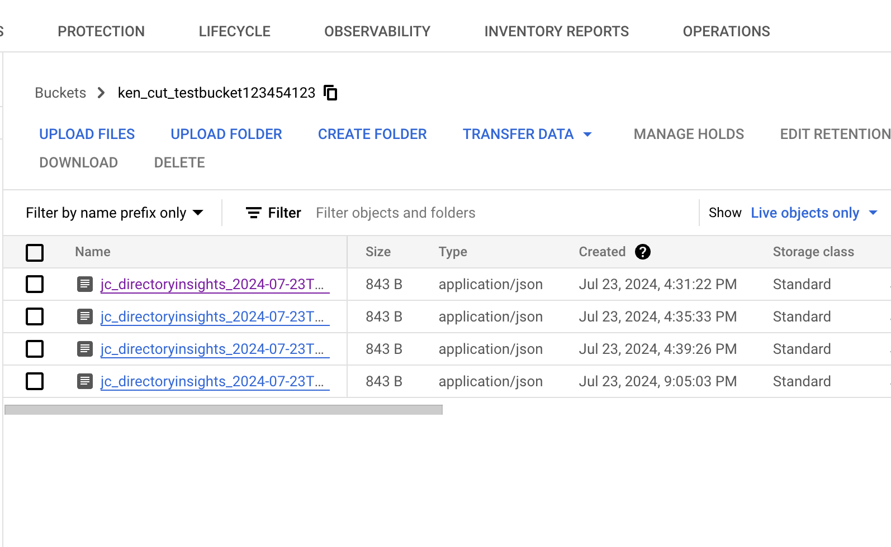

# Gather JumpCloud Directory Insights Data with GCP Services
_This document will walk a JumpCloud Administrator through deploying this Serverless Application to GCP._

_Note: This document assumes the use of Python 3.9 on GCP Cloud Functions_

## Table of Contents

- [Gather JumpCloud Directory Insights Data with GCP Services](#gather-jumpcloud-directory-insights-data-with-gcp-services)
  - [Table of Contents](#table-of-contents)
  - [Pre-requisites](#pre-requisites)
  - [Create Directory to Store Directory Insights Files](#create-directory-to-store-directory-insights-files)
  - [Edit CloudBuild.yaml](#edit-cloudbuildyaml)
  - [Deploying the Application](#deploying-the-application)
  - [Remove Cloud Build Roles](#remove-cloud-build-roles)

## Pre-requisites

- [Your JumpCloud API key](https://docs.jumpcloud.com/2.0/authentication-and-authorization/authentication-and-authorization-overview)
- Google Cloud Admin/Owner account with these roles:
  - ```roles/serviceusage.serviceUsageAdmin```
  - ```roles/cloudbuild.builds.editor```
  - ```roles/resourcemanager.projects.setIamPolicy```
- [GCLOUD CLI installed](https://cloud.google.com/sdk/docs/install)
  - After installing the CLI, run ```gcloud auth login``` and login with your Admin/Owner account
- On your CLI, run these commands to enable the [services](https://cloud.google.com/apis?hl=en) needed to build the app:

```bash
gcloud services enable cloudbuild.googleapis.com
gcloud services enable cloudfunctions.googleapis.com
gcloud services enable cloudscheduler.googleapis.com
gcloud services enable storage-component.googleapis.com
gcloud services enable secretmanager.googleapis.com
gcloud services enable cloudresourcemanager.googleapis.com
```

- Your GCP Project ID and Number, on your CLI you can run ```gcloud projects list``` to get your project's name and ID
  - On your CLI create a variable for Project ID and Number so that you won't need to insert these variables on the commands below:
    - ```PROJECTID=INSERTYOURGCPID```
    - ```PROJECTNUM=INSERTYOURGCPNUM```
- You must assign the Cloud Build Service account ```ProjectNumber@cloudbuild.gserviceaccount.com``` [roles](https://console.cloud.google.com/cloud-build/settings/). This account serves as an identity with specific roles to build the necessary services. [Cloud Build Service Account](https://cloud.google.com/build/docs/cloud-build-service-account)
  
```bash
#Cloud Functions Developer
gcloud projects add-iam-policy-binding $PROJECTID --member=serviceAccount:$PROJECTNUM@cloudbuild.gserviceaccount.com --role=roles/cloudfunctions.developer
#Service Account User
gcloud projects add-iam-policy-binding $PROJECTID --member=serviceAccount:$PROJECTNUM@cloudbuild.gserviceaccount.com --role=roles/iam.serviceAccountUser
#Secrets Manager Admin
gcloud projects add-iam-policy-binding $PROJECTID --member=serviceAccount:$PROJECTNUM@cloudbuild.gserviceaccount.com --role roles/secretmanager.admin
#Storage Admin
gcloud projects add-iam-policy-binding $PROJECTID --member=serviceAccount:$PROJECTNUM@cloudbuild.gserviceaccount.com --role roles/storage.admin
#Cloud Functions Invoker
gcloud projects add-iam-policy-binding $PROJECTID --member=serviceAccount:$PROJECTNUM@cloudbuild.gserviceaccount.com --role roles/cloudfunctions.invoker
#Cloud Build Builder
gcloud projects add-iam-policy-binding $PROJECTID --member=serviceAccount:$PROJECTNUM@cloudbuild.gserviceaccount.com --role roles/cloudbuild.builds.builder
#Cloud Scheduler Admin
gcloud projects add-iam-policy-binding $PROJECTID --member=serviceAccount:$PROJECTNUM@cloudbuild.gserviceaccount.com --role roles/cloudscheduler.admin
```

- You must also assign roles to the App Engine service account ```*@appspot.gserviceaccount.com```. This account serves as identity when accessing Cloud Storage and Secret Manager. [Function Identity](https://cloud.google.com/functions/docs/securing/function-identity#:~:text=Every%20function%20is%20associated%20with,as%20its%20runtime%20service%20account.)

```bash
#Secret Manager Secret Accessor
gcloud projects add-iam-policy-binding $PROJECTID --member=serviceAccount:$PROJECTID@appspot.gserviceaccount.com --role roles/secretmanager.secretAccessor
#Storage Admin
gcloud projects add-iam-policy-binding $PROJECTID --member=serviceAccount:$PROJECTID@appspot.gserviceaccount.com  --role roles/storage.admin
#Cloud Functions Invoker
gcloud projects add-iam-policy-binding $PROJECTID --member=serviceAccount:$PROJECTID@appspot.gserviceaccount.com --role roles/cloudfunctions.invoker
```
  
## Create Directory to Store Directory Insights Files

Create a directory to store your Serverless Application and any dependencies required. In the root of that directory add [Directory Insights Files](https://github.com/TheJumpCloud/JumpCloud-Serverless/blob/master/GCP/DirectoryInsights/).

## Edit CloudBuild.yaml

In the root directory, edit cloudbuid.yaml file `substitutions` variable values `CHANGEVALUE` with the necessary credentials

## Deploying the Application

Using the GCLOUD CLI, you can [Cloud Build Deploy](https://cloud.google.com/sdk/gcloud/reference/builds/submit) directly from the project directory

```bash
~/DirectoryInsights$ gcloud builds submit
```

_Note: `gcloud builds submit` default config is "cloudbuild.yaml" which is why we do not need to specify `--config=config.yaml` tag_
_Note: `.gcloudignore` file excludes unwanted files/folders from getting push in the deploy process_
_Note: After a succesfull build, validate that each services are running properly. You can do this by doing a FORCE RUN on the schedule we created, this will trigger the function to run the DI app script and saved the log files to Cloud Scheduler:_




Using the GCLOUD CLI, you can [Cloud Build Deploy](https://cloud.google.com/sdk/gcloud/reference/builds/submit) directly from the project directory

## Remove Cloud Build Roles

_Note: After a successful build, it is good practice to cleanup the roles we provided to the Cloud Build service account as it is not needed to be used anymore. On your CLI, run the commands below:

```bash
#Cloud Functions Developer
gcloud projects remove-iam-policy-binding $PROJECTID --member=serviceAccount:$PROJECTNUM@cloudbuild.gserviceaccount.com --role=roles/cloudfunctions.developer
# Service Account User
gcloud projects remove-iam-policy-binding $PROJECTID --member=serviceAccount:$PROJECTNUM@cloudbuild.gserviceaccount.com --role=roles/iam.serviceAccountUser
#Secrets Manager Admin
gcloud projects remove-iam-policy-binding $PROJECTID --member=serviceAccount:$PROJECTNUM@cloudbuild.gserviceaccount.com --role roles/secretmanager.admin
#Storage Admin
gcloud projects remove-iam-policy-binding $PROJECTID --member=serviceAccount:$PROJECTNUM@cloudbuild.gserviceaccount.com --role roles/storage.admin
#Cloud Functions Invoker
gcloud projects remove-iam-policy-binding $PROJECTID --member=serviceAccount:$PROJECTNUM@cloudbuild.gserviceaccount.com --role roles/cloudfunctions.invoker
#Cloud Build Builder
gcloud projects remove-iam-policy-binding $PROJECTID --member=serviceAccount:$PROJECTNUM@cloudbuild.gserviceaccount.com --role roles/cloudbuild.builds.builder
#Cloud Scheduler Admin
gcloud projects remove-iam-policy-binding $PROJECTID --member=serviceAccount:$PROJECTNUM@cloudbuild.gserviceaccount.com --role roles/cloudscheduler.admin
```